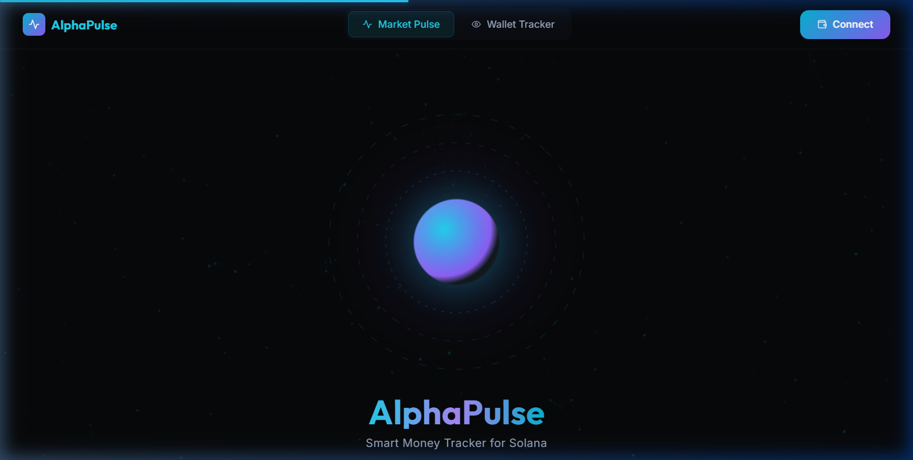

# AlphaPulse: Solana Smart Money Tracker



**Live Demo:** [https://alpha-pulse-9mrjsbjfu-thecodenottakent-ts-projects.vercel.app](https://alpha-pulse-9mrjsbjfu-thecodenottakent-ts-projects.vercel.app)

> **Built with Eitherway:** AlphaPulse's complete React architecture, custom Framer Motion physics engine, and staggered Birdeye data fetching were engineered and compiled natively using Eitherway's AI infrastructure.

AlphaPulse is a high-fidelity terminal designed to track real-time smart money movements and market intelligence across the Solana ecosystem. Built for the Frontier Hackathon, it leverages the Birdeye API to provide institutional-grade data visualization and whale tracking in a responsive, cyber-financial interface.

## Core Features

**Market Pulse Terminal & Volatility Index**
Real-time monitoring of the top Solana tokens by 24-hour volume. The UI features a mathematically derived Volatility Band that visually shifts colors and animation speeds based on network-wide price action.

**Execution Layer (Jupiter)**
Bridging the gap between data and execution, AlphaPulse integrates Jupiter deep-links directly into the token drawer, allowing users to capture alpha instantly upon detecting smart money accumulation.

**Whale Tracker & Smart Money Alerts**
Autonomous monitoring of high-value transactions for major Solana tokens. The system detects large-scale movements and pushes real-time toast notifications for significant buy/sell pressure.

**Signal Intelligence & Token Security**
A custom, zero-dependency SVG charting engine combined with a dynamic Signal Score gauge (calculating on-chain buy/sell ratios) and comprehensive Birdeye security audits (mint authority, freeze authority, and holder concentration).

## Commercial Potential & Business Model

AlphaPulse is designed to scale beyond a read-only dashboard into a profitable execution terminal:
1. **B2B Routing Fees:** The architecture is designed to capture volume-based routing fees via Jupiter's referral program. Fee account registration is the final production step before revenue capture begins.
2. **AlphaPulse Pro (SaaS):** The free-tier retail interface acts as a top-of-funnel acquisition channel. Institutional traders can upgrade to unlock unlimited wallet tracking, real-time webhooks, and full historical trader PnL exports.

## Technical Stack

* **Frontend:** React 18, Vite
* **Styling:** Vanilla CSS, Tailwind CSS
* **Animations:** Framer Motion (physics-based interactions and motion-first UI)
* **Data Intelligence:** Birdeye API (Primary), DexScreener API (Secondary Fallback)
* **Wallet Context:** Solana Wallet Adapter

## Birdeye Integration Depth

AlphaPulse is designed to showcase the full power of Birdeye Data Intelligence, utilizing a custom parallel-fetching architecture to optimize network throughput. The application integrates six distinct Birdeye endpoints:
1. **Token List:** Powering the main ecosystem leaderboard.
2. **Token Overview:** Providing price, volume, and transaction counts.
3. **OHLCV Candles:** Rendering the 24-hour price action charts.
4. **Top Traders:** Summarizing whale activity.
5. **Token Security:** Fetching on-chain security metrics and trust scores.
6. **Trending Tokens:** Identifying high-velocity assets in real-time.

> **Architecture Note:** The Birdeye API key is intentionally exposed client-side for the ease of this hackathon demo. In a production environment, all Birdeye fetches are routed through a secure backend proxy to protect API credentials.

## Getting Started

Install dependencies:

```
npm install
```

Create a `.env` file in the root directory and add your Birdeye API key:

```
VITE_BIRDEYE_API_KEY=your_key_here
```

Start the development server:

```
npm run dev
```

Build for production:

```
npm run build
```
